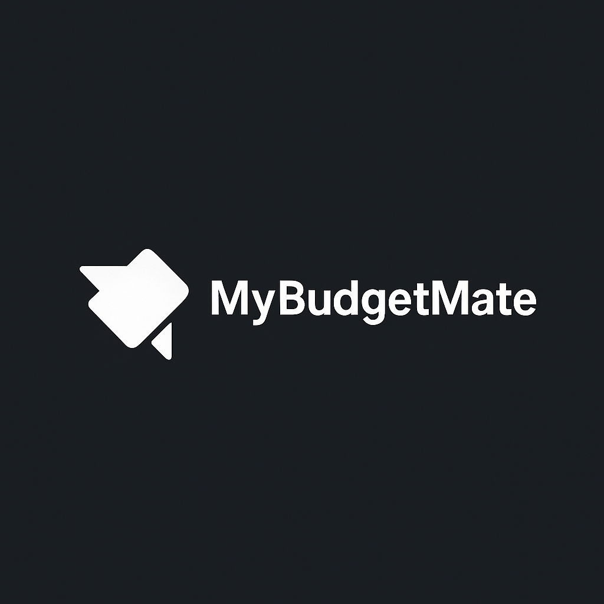

# MyBudgetMate
MyBudgetMate is a smart personal budgeting tool that helps you track income, expenses, savings goals, and get AI-driven budget tips. Simple, beautiful, and powerful—perfect for anyone looking to manage money effectively.
# 💸 MyBudgetMate

**MyBudgetMate** is your all-in-one personal budgeting assistant. Track your income, expenses, savings goals, and receive AI-powered budget tips—all in a beautiful modern interface.

## 🚀 Features

- Add & filter Income / Expenses
- Set monthly savings goals
- View summary charts and PDF report
- Get AI Budget Tips to save better
- Secure login system
- Modern, mobile-friendly UI

## 🖼 Preview



## ⚙️ How to Run

1. Clone the repo:
```bash
git clone https://github.com/yourusername/mybudgetmate.git
cd mybudgetmate
